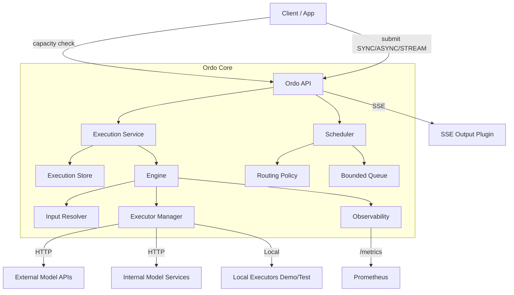

# 🏗️ Architecture (v0.1)

This document describes Ordo v0.1 architecture as an **application-side multimodal inference hub**.

Ordo focuses on:
- workflow orchestration (DAG)
- capacity-aware scheduling (multi-deployment + bounded queue)
- plugin-based executors (HTTP/local) + SSE streaming events
- observability (Prometheus)

> v0.1 is OSS-friendly and demo-first:
> - in-memory execution store and queues
> - sequential stage execution
> - SSE provides lifecycle/progress events (token streaming is a future extension)

---

## 1) Goals

### ✅ What Ordo solves
- Orchestrate **internal model services** and **external model APIs** as workflow stages
- Manage **workflow versions** and run different versions side-by-side
- Route traffic across **multi-cloud/multi-DC deployments** for the same version
- Enforce **bounded admission** to protect SLA: `slots` + `queueSize`
- Provide app-friendly execution modes: **SYNC / ASYNC / STREAM**
- Provide metrics to build an ops dashboard: capacity, queue depth, latency, success rate

### ❌ Non-goals (v0.1)
- Model training / model registry
- A full model serving system (autoscaling, GPU scheduling, etc.)
- Persistent queue and durable execution state (planned in v0.2+)
- Parallel stage execution (planned later)

---

## 2) Core Components

### 2.1 Workflow Registry
- Loads workflow YAML from `paths.workflowDir`
- Key: `(workflow_id, version)`
- Provides:
  - stage DAG definition
  - input schema (informational in v0.1)
  - stage executors (logical names)
  - output mapping (artifacts/metadata)

### 2.2 Scheduler
The Scheduler implements **capacity-aware routing** for `(workflow_id, version)`.

Inputs:
- Submit hint (workflow/version + routing/inputs)
- Routing policy YAML (`paths.routingDir`)
- Deployment set YAML (`paths.deploymentDir`)

Decisions:
- **accepted**: can run immediately (inflight < slots)
- **queued**: inflight full but queue has room
- **rejected**: queue full or no capacity → return HTTP 409

Key semantics:
- atomic admission per deployment
- bounded queue (B+)
- multi-deployment routing (labels/weights + failover)

### 2.3 Execution Store
- Stores `Execution` objects:
  - workflow/version/deployment
  - inputs/routing
  - per-stage states (status + artifacts/metadata)
  - final outputs + terminal status
- v0.1 uses in-memory store.

### 2.4 Engine
The Engine executes a workflow DAG:
1. load execution by `task_id`
2. load workflow spec by `(workflow_id, version)`
3. compute topo order (detect cycles)
4. stage-by-stage:
   - resolve stage inputs (fromInputs/fromStage artifacts)
   - call executor (HTTP/local)
   - write stage outputs & status
5. map final outputs and mark terminal

### 2.5 Plugin System (v0.1 scope)
- Executors:
  - HTTP executor plugin: call remote service/API
  - Local executor plugin: demo/testing behaviors
- Output:
  - SSE output plugin for streaming events

The mapping from **logical executor name** to implementation is defined in `providers.yaml`.

---

## 3) Request Flows

### 3.1 Submit (SYNC)
1. Client calls `POST /v1/executions (mode=SYNC)`
2. Scheduler Route+Admit
3. If accepted:
   - Engine runs immediately
   - Server waits terminal and returns execution
4. If queued:
   - Server waits until terminal (up to timeout)
5. If rejected:
   - return 409

### 3.2 Submit (ASYNC)
1. Client calls `POST /v1/executions (mode=ASYNC)`
2. Scheduler Route+Admit
3. Return `{task_id, accepted|queued}` immediately
4. Engine runs when:
   - accepted → immediately
   - queued → after inflight release triggers dequeue
5. Optional callback: `callback_url` receives result payload

### 3.3 Submit (STREAM)
1. Client calls `POST /v1/executions (mode=STREAM)`
2. Return `{task_id}`
3. Client subscribes `GET /v1/executions/{task_id}/stream`
4. Engine emits SSE events: `start`, `stage_*`, `final`

---

## 4) Architecture Diagram

------

## 5) Key Data Models

### Execution (runtime object)

- `task_id`
- `workflow_id`, `version`, `deployment_id`
- `mode`: SYNC / ASYNC / STREAM
- `status`: PENDING / RUNNING / SUCCEEDED / FAILED
- `stages[]`: per-stage status + outputs
- `outputs`: final outputs mapped by workflow `spec.outputs`

### ArtifactRef

Artifacts are passed by reference:

- `uri` (e.g. `s3://...`, `oss://...`, `mock://...`)
- `content_type` (optional)

------

## 6) Extension Points

Ordo v0.1 keeps the core small and extends via plugins:

- executor plugins (HTTP/local)
- output plugins (SSE)
   Future extensions:
- artifact store plugins (S3/OSS/GCS)
- workflow engine plugins (Argo integration)
- queue backends (Redis/NATS)
- auth integrations (OIDC/API key)

------

## 7) Production Notes (beyond v0.1)

- Durable execution store + queue are required for safe restarts
- Multi-instance Ordo requires shared state + leader election (or sharded routing)
- Token-level streaming requires a standardized executor streaming contract